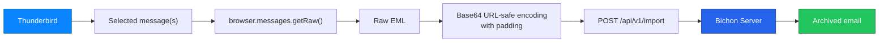

<p align="center">
  
</p>

<h1 align="center">Bichon Thunderbird Archiver</h1>

<p align="center">
  <strong>One-click Thunderbird email archiving for your self-hosted Bichon server.</strong>
</p>

<p align="center">
  <a href="#-quick-start">Quick Start</a>
  ·
  <a href="#-features">Features</a>
  ·
  <a href="#-architecture">Architecture</a>
  ·
  <a href="#-configuration">Configuration</a>
  ·
  <a href="#-troubleshooting">Troubleshooting</a>
  ·
  <a href="#-roadmap">Roadmap</a>
</p>

<p align="center">
  
  
  
  
  
</p>

<p align="center">
  
  
  
  
</p>

---

## ✨ What is it?

**Bichon Thunderbird Archiver** is a Thunderbird WebExtension that archives selected emails directly into a self-hosted **Bichon** server.

It extracts the selected email as raw EML, encodes it in the format expected by Bichon, and sends it through the official Bichon API:

```http
POST /api/v1/import
```

<p align="center">
  <strong>Thunderbird → EML → Base64URL → Bichon API → Archived Mail</strong>
</p>

---

## 🎯 Why this extension?

Bichon is powerful, lightweight and self-hosted — but email archival should also be easy for end users.

This extension turns Thunderbird into a friendly archival client.

<table>
<tr>
<td width="50%">

### ❌ Without the extension

- Manual EML export
- Manual import workflow
- Repetitive actions
- CLI required for some workflows
- Less friendly for end users

</td>
<td width="50%">

### ✅ With the extension

- Select one or multiple emails
- Click the Bichon icon
- Send directly to Bichon
- Get instant feedback
- Debug issues visually

</td>
</tr>
</table>

---

## 🚀 Quick Start

### 1. Install the extension temporarily

```text
Thunderbird
→ Add-ons and Themes
→ Gear icon
→ Debug Add-ons
→ Load Temporary Add-on
→ Select manifest.json
```

### 2. Configure Bichon settings

| Setting | Example |
|---|---|
| Bichon URL | `http://192.168.1.50:15630` |
| API Endpoint | `/api/v1/import` |
| Account ID | `8416659527311215` |
| Archive Folder | `Thunderbird` |
| Auth Mode | `Authorization: Bearer TOKEN` |

### 3. Archive an email

```text
Select email → Click Bichon icon → Archive selected messages
```

---

## 🧩 Features

<table>
<tr>
<td width="33%">

## 📨 Thunderbird Native

- Thunderbird 140+
- Uses Thunderbird WebExtension APIs
- Reads selected messages
- Extracts raw EML
- Supports multi-selection

</td>
<td width="33%">

## 🔌 Bichon API

- Official Bichon import endpoint
- Bearer token support
- Configurable API URL
- Configurable account ID
- Configurable target folder

</td>
<td width="33%">

## 🛠️ Debug Friendly

- Full debug report
- API request details
- CORS diagnostics
- Base64 diagnostics
- Bichon response details

</td>
</tr>
<tr>
<td width="33%">

## 🎨 User Friendly

- Clean popup
- Options page
- Custom icon
- Visual notifications
- README-ready branding

</td>
<td width="33%">

## 🧪 Tested Workflow

- Thunderbird 140
- Bichon 1.x
- Debian 13
- Native Bichon server
- REST API import

</td>
<td width="33%">

## 🔐 Self-Hosted

- Works on LAN
- Works behind VPN
- Works with Tailscale
- Works behind reverse proxy
- No third-party cloud required

</td>
</tr>
</table>

---

## 🏗️ Architecture



Fallback view:

```text
┌─────────────┐
│ Thunderbird │
└──────┬──────┘
       │ selected email
       ▼
┌──────────────────────┐
│ messages.getRaw()    │
└──────┬───────────────┘
       │ raw EML
       ▼
┌─────────────────────────────┐
│ Base64 URL-safe + padding   │
└──────┬──────────────────────┘
       │ JSON payload
       ▼
┌─────────────────────────────┐
│ POST /api/v1/import         │
└──────┬──────────────────────┘
       │
       ▼
┌───────────────┐
│ Bichon Server │
└───────────────┘
```

---

## 🔌 API Details

The extension sends:

```http
POST /api/v1/import
Authorization: Bearer <token>
Content-Type: application/json; charset=utf-8
```

Payload:

```json
{
  "account_id": 8416659527311215,
  "mail_folder": "Thunderbird",
  "emls": [
    "BASE64_URL_SAFE_EML_WITH_PADDING"
  ]
}
```

### API response example

```json
{
  "failed": 0,
  "failed_details": [],
  "success": 1,
  "total": 1
}
```

---

## 🧬 Base64 Compatibility

During testing, Bichon required a specific Base64 variant.

| Encoding | Result |
|---|---|
| Standard Base64 with `/` | ❌ Rejected |
| URL-safe Base64 without `=` padding | ❌ Rejected |
| URL-safe Base64 with `=` padding | ✅ Works |

Working conversion:

```text
+  →  -
/  →  _
=  kept as padding
```

Example:

```javascript
const encoded = standardBase64
  .replace(/\+/g, "-")
  .replace(/\//g, "_");
```

---

## ⚙️ Configuration

Open the extension options and configure the following fields.

### Recommended settings

| Field | Value |
|---|---|
| Bichon URL | `http://YOUR_BICHON_IP:15630` |
| API Endpoint | `/api/v1/import` |
| Account ID | your Bichon account ID |
| Mail Folder | `Thunderbird` |
| Auth Mode | `Authorization: Bearer TOKEN` |
| Token | token only, without `Bearer` |

### Correct token format

✅ Correct:

```text
Token field:
DqqEjFAdskXQL1CZvlSmuYDn

Auth mode:
Authorization: Bearer TOKEN
```

❌ Incorrect:

```text
Token field:
Bearer DqqEjFAdskXQL1CZvlSmuYDn

Auth mode:
Authorization: Bearer TOKEN
```

---

## 🌐 CORS

Bichon must allow both origins:

| Origin | Example |
|---|---|
| Bichon WebUI | `http://192.168.1.50:15630` |
| Thunderbird extension | `moz-extension://xxxxxxxx` |

Example:

```ini
BICHON_CORS_ORIGINS=http://192.168.1.50:15630,moz-extension://YOUR_EXTENSION_UUID
```

Restart Bichon after editing `/etc/bichon.env`:

```bash
sudo systemctl restart bichon
```

### Important note

Temporary Thunderbird extensions may change their `moz-extension://...` ID after:

- reload;
- Thunderbird restart;
- temporary add-on reload;
- file modification.

For stable CORS configuration, prefer a persistent/package installation.

---

## 🖼️ Screenshots

> Add your screenshots here.

Suggested screenshots:

| Screenshot | Description |
|---|---|
| `docs/screenshots/popup.png` | Extension popup |
| `docs/screenshots/options.png` | Configuration page |
| `docs/screenshots/debug.png` | Debug report |
| `docs/screenshots/bichon-import.png` | Imported email in Bichon |

Example Markdown:

```markdown

```

---

## 🧪 Tested Environment

| Component | Version |
|---|---|
| Thunderbird | 140 |
| Bichon | 1.x |
| Debian | 13 |
| API endpoint | `/api/v1/import` |
| Deployment | Native Bichon service |
| Auth | Bearer token |
| Import format | EML |

---

## 🧰 Project Structure

```text
.
├── manifest.json
├── background.js
├── popup.html
├── popup.css
├── popup.js
├── options.html
├── options.css
├── options.js
├── icons/
│   ├── bichon-16.png
│   ├── bichon-32.png
│   ├── bichon-48.png
│   ├── bichon-64.png
│   └── bichon-128.png
├── assets/
│   ├── logo.png
│   └── logo-readme.png
├── docs/
│   ├── bichon-api-import.md
│   ├── release-notes-v1.0.4.md
│   └── linkedin-post.md
├── LICENSE
├── README.md
└── package-extension.sh
```

---

## 📦 Packaging

A simple packaging script is included:

```bash
./package-extension.sh
```

It creates a ZIP package in:

```text
dist/
```

---

## 🐞 Troubleshooting

### Token works in curl but not in the extension

Check that:

- token field does not contain `Bearer`;
- auth mode is `Authorization: Bearer TOKEN`;
- CORS allows the extension origin.

### Import works but mail cannot be opened in Bichon WebUI

Usually a CORS issue.

Make sure Bichon allows the WebUI origin:

```ini
BICHON_CORS_ORIGINS=http://YOUR_BICHON_IP:15630,moz-extension://YOUR_EXTENSION_UUID
```

### Extension says `NetworkError when attempting to fetch resource`

Likely causes:

- CORS preflight rejected;
- wrong Bichon URL;
- firewall blocking access;
- extension origin not allowed;
- HTTP/HTTPS mismatch.

### Bichon says `InvalidByte(..., 47)`

This means standard Base64 was rejected because of `/`.

Use Base64 URL-safe encoding.

### Bichon says `InvalidPadding`

This means padding was removed.

Keep `=` padding.

---

## 🔍 Debug Report

The extension can generate a detailed debug report.

It includes:

```text
- selected message ID
- subject
- author
- raw EML size
- Base64 size
- API URL
- masked authorization header
- account ID
- target folder
- HTTP status
- Bichon response body
- CORS/network errors
```

This helps identify issues quickly.

---

## 🔐 Security Notes

This extension sends selected emails to your configured Bichon server.

Recommended deployment options:

- trusted LAN;
- VPN;
- Tailscale;
- HTTPS reverse proxy;
- authenticated gateway.

Avoid exposing Bichon directly to the Internet without proper access controls.

Keep your Bichon API token private.

---

## 🛣️ Roadmap

### Short term

- [ ] Improve UI polish
- [ ] Add persistent installation documentation
- [ ] Add screenshots
- [ ] Improve error messages
- [ ] Add account auto-discovery UI

### Medium term

- [ ] Folder mapping
- [ ] Context menu integration
- [ ] Archive progress bar
- [ ] Queue and retry system
- [ ] Batch import status
- [ ] Better CORS helper documentation

### Long term

- [ ] Thunderbird Add-ons publication
- [ ] Signed release
- [ ] Internationalization
- [ ] OAuth/token helper
- [ ] Automatic archive rules
- [ ] Per-folder archival policies

---

## 🤝 Contributing

Contributions are welcome.

Good first contributions:

- improve the popup UI;
- add screenshots;
- test with more Thunderbird versions;
- improve packaging;
- improve Bichon API compatibility;
- add translations.

---

## 📚 Useful Resources

- [Bichon GitHub](https://github.com/rustmailer/bichon)
- [Thunderbird Developer Documentation](https://developer.thunderbird.net/)
- [Thunderbird WebExtension API](https://webextension-api.thunderbird.net/)
- [Mozilla WebExtensions](https://developer.mozilla.org/en-US/docs/Mozilla/Add-ons/WebExtensions)

---

## ⚠️ Disclaimer

This project is an independent community project.

It is not affiliated with, endorsed by, or sponsored by Mozilla, Thunderbird, or the Bichon project maintainers.

Thunderbird is a trademark of the Mozilla Foundation.  
Bichon belongs to its respective authors.

The logo uses a generic blue bird mascot and a generic Bichon-style dog illustration. It does not use the official Thunderbird logo.

---

## 📜 License

MIT License.

---

<p align="center">
  <strong>Made for self-hosted email archiving workflows.</strong>
</p>

<p align="center">
  Thunderbird · Bichon · Open Source · Self-hosted
</p>
