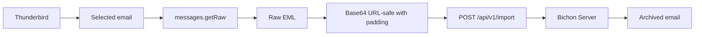

<p align="center">
  
</p>

<h1 align="center">Bichon Thunderbird Archiver</h1>

<p align="center">
  <strong>Archive Thunderbird emails directly into your self-hosted Bichon server.</strong>
</p>

<p align="center">
  <a href="https://github.com/rustmailer/bichon">
    
  </a>
  
  
  
  
</p>

<p align="center">
  <a href="#-overview">Overview</a>
  ·
  <a href="#-features">Features</a>
  ·
  <a href="#-installation">Installation</a>
  ·
  <a href="#-configuration">Configuration</a>
  ·
  <a href="#-cors">CORS</a>
  ·
  <a href="#-debugging">Debugging</a>
</p>

---

## ✨ Overview

**Bichon Thunderbird Archiver** is a Thunderbird extension that lets users archive selected emails directly into a self-hosted **Bichon** server through the official Bichon API.

It turns Thunderbird into a simple archival client:

<p align="center">
  <strong>Select email → Click Bichon → Archive into Bichon</strong>
</p>

No manual EML export.  
No command-line import.  
No copy/paste workflow.

---

## 🎯 Purpose

Bichon already provides a powerful email archiving backend.  
This extension adds a friendly Thunderbird workflow on top of it.

<table>
<tr>
<td width="50%">

### Before

- Export EML manually
- Use CLI import
- Repeat for selected mails
- Less user-friendly

</td>
<td width="50%">

### With this extension

- Select one or many emails
- Click the Bichon icon
- Send directly to Bichon
- Get debug feedback if needed

</td>
</tr>
</table>

---

## 🧩 Features

<table>
<tr>
<td width="33%">

### 📨 Thunderbird Native

- Thunderbird 140+
- Raw EML extraction
- Single mail archive
- Multi-selection support

</td>
<td width="33%">

### 🔌 Bichon API

- `POST /api/v1/import`
- Bearer token support
- Account ID configuration
- Target folder configuration

</td>
<td width="33%">

### 🛠️ Debug Friendly

- Full debug report
- CORS diagnostics
- Base64 diagnostics
- API response logging

</td>
</tr>
</table>

---

## 🏗️ Architecture



Fallback plain-text view:

```text
Thunderbird
    ↓
Selected message(s)
    ↓
browser.messages.getRaw()
    ↓
Raw EML
    ↓
Base64 URL-safe encoding with padding
    ↓
POST /api/v1/import
    ↓
Bichon Server
    ↓
Archived mail
```

---

## 🔌 Bichon API

The extension sends email content to Bichon using:

```http
POST /api/v1/import
Authorization: Bearer <token>
Content-Type: application/json; charset=utf-8
```

Example payload:

```json
{
  "account_id": 8416659527311215,
  "mail_folder": "Thunderbird",
  "emls": [
    "BASE64_URL_SAFE_EML_WITH_PADDING"
  ]
}
```

---

## 🧪 Base64 Compatibility

During testing, Bichon required a specific Base64 format.

| Format | Result |
|---|---|
| Standard Base64 with `/` | Rejected |
| URL-safe Base64 without padding | Rejected |
| URL-safe Base64 with `=` padding | Works |

Working conversion:

```text
+  →  -
/  →  _
=  kept as padding
```

---

## 📦 Installation

### Development / temporary loading

1. Download or clone this repository.
2. Open Thunderbird.
3. Go to:

```text
Tools → Add-ons and Themes → Gear icon → Debug Add-ons
```

4. Click:

```text
Load Temporary Add-on
```

5. Select:

```text
manifest.json
```

---

## ⚙️ Configuration

Open the extension options and configure:

| Option | Example |
|---|---|
| Bichon URL | `http://192.168.1.50:15630` |
| API Endpoint | `/api/v1/import` |
| Account ID | `8416659527311215` |
| Archive Folder | `Thunderbird` |
| Token | `your_bichon_token` |
| Auth Mode | `Authorization: Bearer TOKEN` |

> When using Bearer mode, paste only the token itself. Do not include the word `Bearer` in the token field.

Correct:

```text
Token: DqqEjFAdskXQL1CZvlSmuYDn
Auth mode: Authorization: Bearer TOKEN
```

Incorrect:

```text
Token: Bearer DqqEjFAdskXQL1CZvlSmuYDn
Auth mode: Authorization: Bearer TOKEN
```

---

## 🌐 CORS

Bichon must allow both:

1. the Bichon WebUI origin;
2. the Thunderbird extension origin.

Example:

```ini
BICHON_CORS_ORIGINS=http://192.168.1.50:15630,moz-extension://YOUR_EXTENSION_UUID
```

Then restart Bichon:

```bash
sudo systemctl restart bichon
```

> Temporary Thunderbird extensions may get a different `moz-extension://...` origin after reloads or restarts. For a more stable setup, install/package the extension persistently.

---

## 🚀 Usage

1. Select one or more emails in Thunderbird.
2. Click the Bichon icon.
3. Click **Archive selected messages**.
4. Wait for the notification.
5. Open Bichon WebUI and check your configured folder.

---

## 🐞 Debugging

The extension includes a detailed debug mode.

It reports:

<table>
<tr>
<td>

- selected message metadata
- raw EML size
- Base64 size
- encoding mode

</td>
<td>

- request URL
- masked token
- account ID
- target folder

</td>
<td>

- HTTP status
- Bichon response
- CORS errors
- Thunderbird API errors

</td>
</tr>
</table>

This makes it easier to troubleshoot:

- invalid token;
- wrong account ID;
- CORS issue;
- unsupported Base64 format;
- API response errors.

---

## 🗂️ Project Structure

```text
.
├── manifest.json
├── background.js
├── popup.html
├── popup.css
├── popup.js
├── options.html
├── options.css
├── options.js
├── icons/
├── assets/
├── docs/
├── LICENSE
├── README.md
└── package-extension.sh
```

---

## ✅ Tested Environment

| Component | Version |
|---|---|
| Thunderbird | 140 |
| Bichon | 1.x |
| Debian | 13 |
| API endpoint | `/api/v1/import` |
| Deployment | Native Bichon service |

---

## 🛣️ Roadmap

- [ ] Stable packaged release
- [ ] Thunderbird Add-ons publication
- [ ] Automatic account discovery
- [ ] Better folder mapping
- [ ] Context menu integration
- [ ] Queue and retry system
- [ ] Archive status indicator
- [ ] Bulk archive progress bar
- [ ] Internationalization
- [ ] Signed release workflow

---

## 🔐 Security Notes

This extension sends selected email content to the configured Bichon server.

Recommended deployment patterns:

- trusted LAN;
- VPN;
- Tailscale;
- HTTPS reverse proxy;
- authenticated gateway.

Avoid exposing Bichon directly to the Internet without proper access controls.

---

## ⚠️ Disclaimer

This project is an independent community project.

It is not affiliated with, endorsed by, or sponsored by Mozilla, Thunderbird, or the Bichon project maintainers.

Thunderbird is a trademark of the Mozilla Foundation.  
Bichon belongs to its respective authors.

---

## 📜 License

MIT License.

---

<p align="center">
  Made for self-hosted email archiving workflows.
</p>
